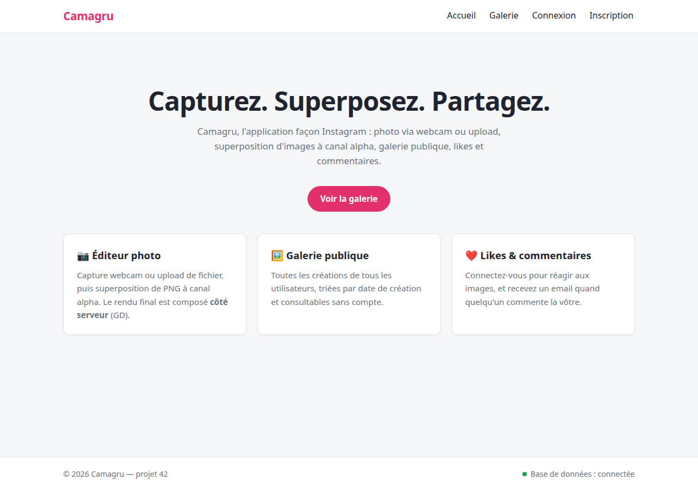
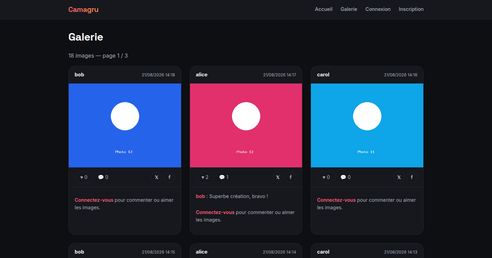

<div align="center">

# 📸 Camagru

**Une petite application web type Instagram** — capture photo (webcam ou upload), superposition d'images, publication dans une galerie publique, likes et commentaires.

Projet de fin d'année de l'école **42** — développé en **PHP vanilla** (zéro dépendance), **JavaScript natif** et **Docker**.

[](https://github.com/lsoulier42/42-camagru/actions/workflows/ci.yml)

</div>

---

## ✨ Fonctionnalités

### Obligatoires
- **Comptes** : inscription, confirmation par email à **jeton unique**, connexion, mot de passe oublié, déconnexion en un clic, édition du profil (username, email, mot de passe).
- **Galerie publique** : toutes les images de tous les utilisateurs, triées par date, **pagination** (6 par page), **likes** et **commentaires** réservés aux connectés.
- **Notification email** à l'auteur d'une image à chaque nouveau commentaire (préférence activée par défaut, désactivable dans le profil).
- **Éditeur** : page protégée, aperçu **webcam** (`getUserMedia`) avec images superposables **PNG à canal alpha**, **superposition composée côté serveur** (GD), upload d'image en alternative, vignettes des photos précédentes, suppression de ses propres images uniquement.

### Bonus
- 🎬 **Aperçu en direct** de la superposition sur le flux webcam avant capture (WYSIWYG).
- ⚡ **Galerie AJAX** : likes, commentaires et pagination sans rechargement (`fetch`, avec repli propre sans JavaScript).
- ♾️ **Pagination infinie** (IntersectionObserver), bouton « Suivant » conservé comme repli sans JS.
- 🔗 **Partage social** X / Facebook par image (dernier commentaire en citation) + **page de détail** `/image/{id}`.
- 🎞️ **Export GIF animé** : l'overlay pulse et flotte sur la capture, encodé **côté serveur en PHP pur** (GIF89a + NETSCAPE2.0).

---

## 📸 Aperçu

| Accueil | Galerie publique |
|---|---|
|  |  |

---

## 🛠️ Stack technique

| Couche | Technologie |
|---|---|
| Backend | **PHP 8.3** — MVC maison, `PDO` (requêtes préparées), `GD` (images), `mail()` → MailHog |
| Frontend | HTML, CSS pur, **JavaScript natif** (aucune librairie) |
| Base de données | **MySQL 8** (utf8mb4) |
| Email (dev) | **MailHog** (UI sur `http://localhost:8025`) |
| Qualité (dev) | **PHPStan** (niveau 6) + **PHPUnit** (intégration MySQL) |
| Déploiement | **Docker Compose** — une seule commande |

Aucun framework ; le **runtime est zéro-dépendance** (bibliothèque standard PHP et API natives du navigateur). Composer n'est utilisé qu'en **développement** : outils de qualité et tests, jamais dans l'image de production.

---

## 🚀 Démarrage rapide

### Prérequis
- Docker + Docker Compose

### Installation

```bash
# 1. Configurer l'environnement (le .env réel est ignoré par git)
cp .env.example .env

# 2. Lancer toute la stack en une commande
docker compose up --build
```

Le site est alors disponible sur **http://localhost:8080** et MailHog sur **http://localhost:8025**.

### Données de démonstration (optionnel)

```bash
# Crée 3 comptes (alice, bob, carol — mot de passe : Seedpass123),
# 13 images et quelques likes/commentaires.
docker compose exec web php scripts/seed.php
```

---

## 📁 Structure du projet

```
├── docker/                 # Config Apache, PHP, ssmtp
├── database/schema.sql     # Schéma MySQL (monté au premier démarrage)
├── docker-compose.yml      # web (8080) + db + mailhog (8025)
├── public/                 # Front controller, assets, uploads
│   └── assets/overlays/    # Images superposables (PNG alpha)
├── scripts/                # seed.php, generate_overlays.php
└── src/
    ├── Controllers/        # Fins : requête → service → vue (Auth, Gallery, Editor, Home)
    ├── Core/               # Router, Container, Database, Csrf, Session, Mailer…
    ├── Entities/           # Entités immuables typées (User, Image, Comment…)
    ├── Repositories/       # Accès SQL, PDO injecté (User, Image, Like…)
    ├── Services/           # Logique métier (AuthService, NotificationService)
    └── Views/              # Vues + layout (header/main/footer)
```

---

## 🔒 Sécurité

- **Mots de passe** hachés (`password_hash` / `password_verify`), jamais en clair.
- **XSS** : toute sortie échappée (`htmlspecialchars`), y compris les commentaires.
- **SQLi** : 100 % de requêtes préparées PDO.
- **CSRF** : jeton par session vérifié sur chaque formulaire POST (réponses JSON 403 en AJAX).
- **Uploads** : triple validation (MIME réel `finfo` + extension + décodage GD) puis **ré-encodage** complet — aucun contenu exécutable n'est stocké.
- **Superposition côté serveur** : le client n'envoie qu'une image ; le rendu final est composé par GD, jamais côté client.
- **Sessions** : cookie `HttpOnly` + `SameSite=Lax`, `session_regenerate_id()` après connexion.
- **Accès** : pages/actions sensibles protégées côté serveur ; suppression limitée à ses propres images ; `return_path` validé (anti open-redirect).
- `.env`, uploads et données de la base **jamais commités** (`.gitignore`).

---

## 🧪 Tests

**Tests automatisés** (outils dev-only, voir « Contribution ») :

- `docker compose exec web vendor/bin/phpunit` — **60 tests** : intégration MySQL sur une base dédiée `camagru_test` (repositories, services, jetons) et unitaires (entités, DTO, conteneur, règles de validation). La base de développement n'est jamais touchée.
- `vendor/bin/phpstan analyse` — analyse statique **niveau 6**, zéro erreur.

Le projet a aussi été vérifié de bout en bout (curl + navigateur réel) :

- Flux complets : inscription → email → confirmation → connexion → profil → déconnexion ; reset de mot de passe.
- Galerie : pagination, tri, likes/commentaires, notification email (et désactivation), défilement infini.
- Éditeur : capture webcam, superposition serveur vérifiée **au pixel près**, uploads refusés (faux PNG, `.php`, `.exe`), suppression.
- Sécurité : SQLi, XSS, CSRF, anti-traversal, open-redirect — tous refusés.
- Consoles : zéro erreur PHP / navigateur / réseau ; responsive validé en mobile et desktop.
- **Intégration continue** (GitHub Actions) : lint PHP + JavaScript, **PHPStan**, **PHPUnit** (service MySQL dédié), vérification qu'aucun fichier sensible n'est committé, build Docker et smoke-test des pages publiques à chaque push.

---

## 🤝 Contribution

1. Créez une branche depuis `main` (`git checkout -b feat/…`) et assurez-vous que tout reste vert avant d'ouvrir une pull request :
   ```bash
   vendor/bin/phpstan analyse
   docker compose exec web vendor/bin/phpunit
   ```
2. La CI (lint, analyse statique, tests, build Docker) valide chaque pull request automatiquement.
3. Ne committez **jamais** `.env`, `docker-data/` ou `public/uploads/` — vérifiés par la CI.

---

## 📄 Licence

Projet pédagogique réalisé dans le cadre de l'école **42**, publié sous licence **MIT** — voir [LICENSE](LICENSE).
